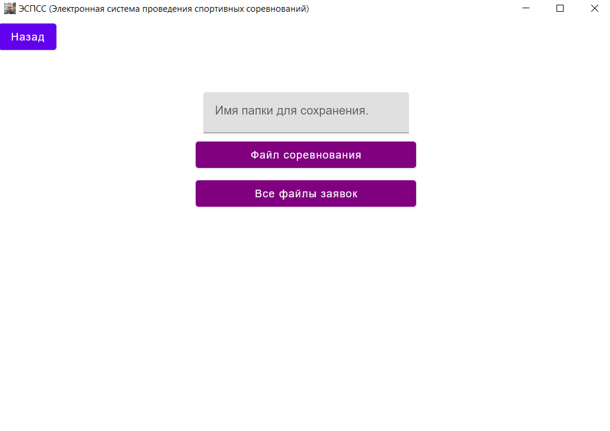
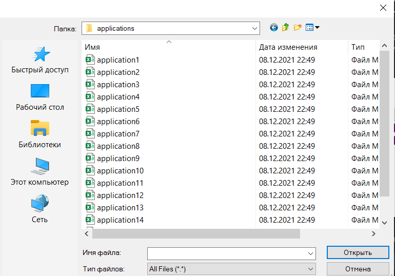
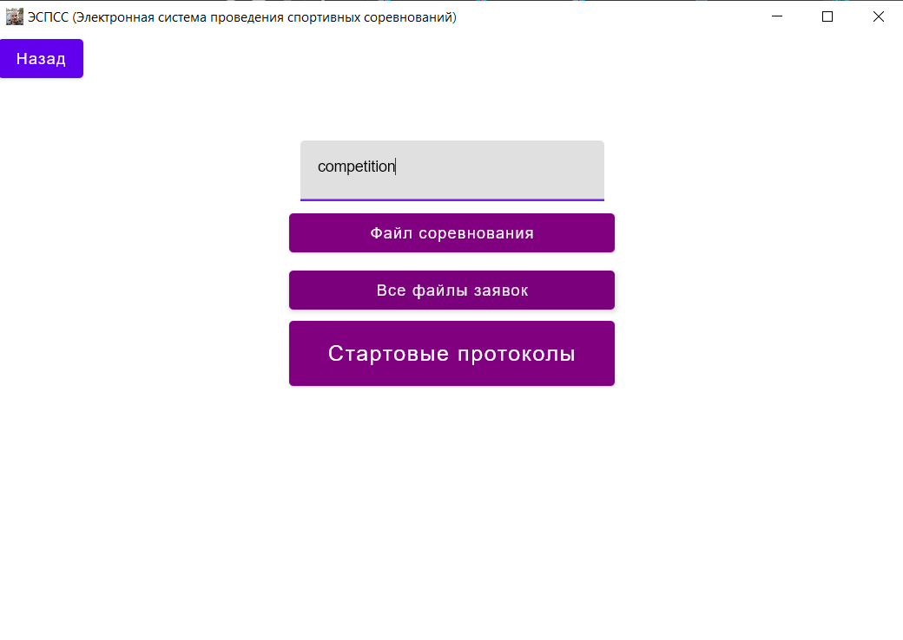
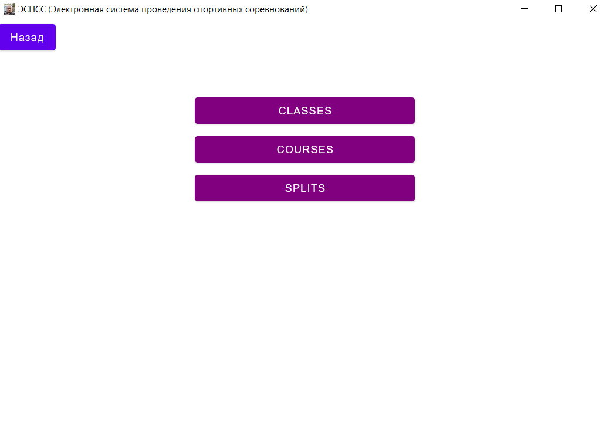
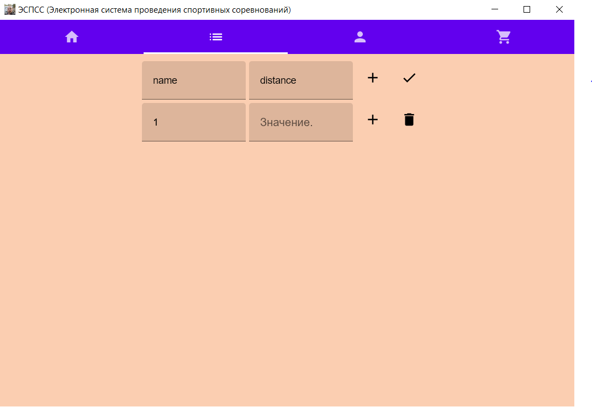
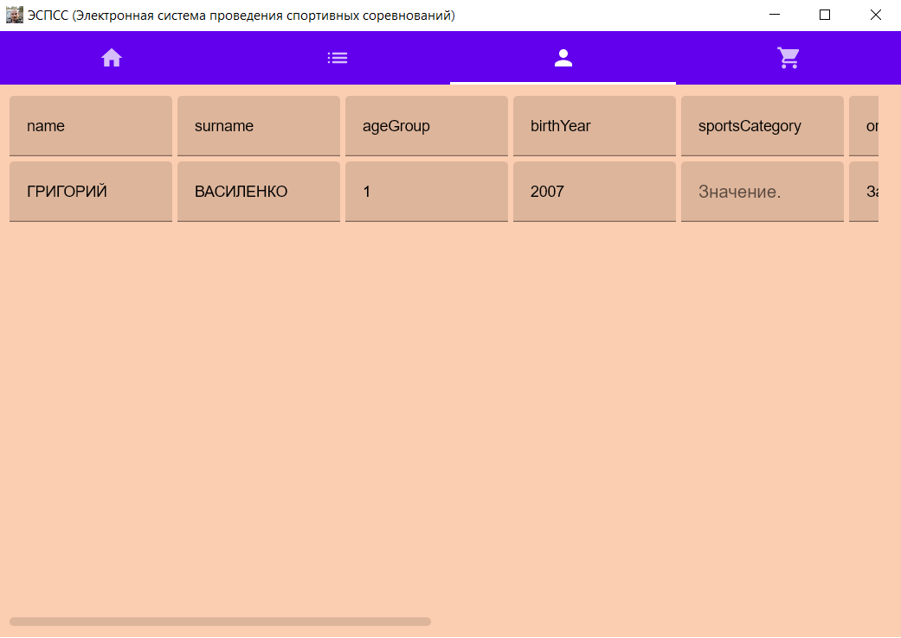
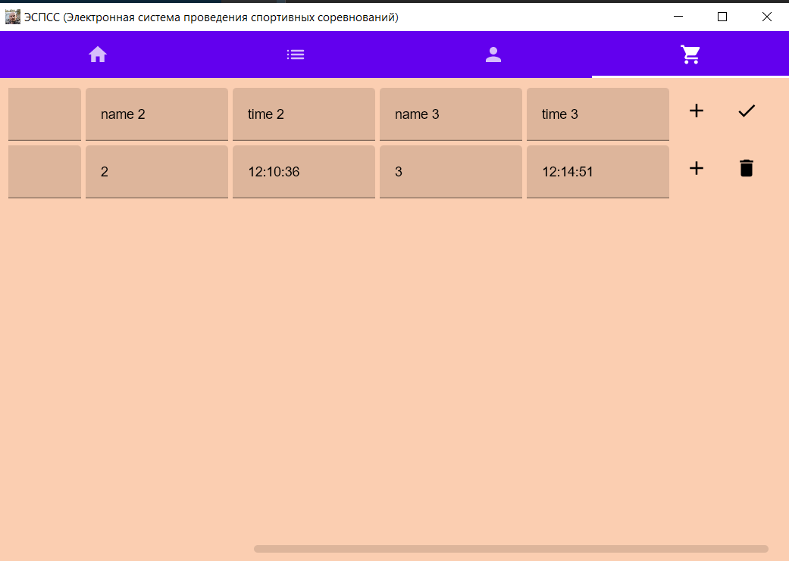

# Электронная система проведения соревнований

## Использование программы

Есть два сценария работы с программой:
* Обработка заявок и создание стартовых протоколов
* Генерация результатов соревнований по данным о прохождении контрольных точек. Последнее можно использовать только после
  создания соответствующего протокола старта
#### Что будет происходить

* При запуске стартового сценария будут созданы протоколы старта для групп, они будут находиться в папке `startProtocols`.

* Финальный сценарий создает файл `results.csv`, в котором будут общие результаты по всем возрастным группам. Также будет создан файл `teamResults.csv` с результатами команд.

Программу можно запустить как через аргументы командной строки, так и используя продвинутый графический интерфейс.

 ###Через аргументы командной строки:
Запуск происходит из файла **algorithm.kt**

Для запуска стартового сценария аргументы командной строки должны быть следующие (и именно в этом порядке):

| Аргумент 1      | Аргумент 2 |Аргумент 3 |Аргумент 4 |
| :-----------: | :-----------: |:-----------: | :-----------: |
|  `start`      | `event.csv` |`applications` |`folder` |
|        | путь к файлу соревнования |папка с заявками | название папки для хранения данных - стартовых протоколов, данных, необходимых для дальнейшей генерации финальных результатов |

Для финального сценария:

| Аргумент 1  |                    Аргумент 2                     |     Аргумент 3     |                                 Аргумент 4                                 | Аргумент 5<br/> |
| :-----------:  |:-------------------------------------------------:|:------------------:|:--------------------------------------------------------------------------:|:----------:|
|  `finish`        |                   `classes.csv`                   |   `courses.csv`    |                                `splits.csv`                                |  `folder`  | |
|       | протокол соответствия возрастной группы дистанции | маршруты дистанций | данные прохождения контрольных точек | директория из предыдущего запуска программы (вы же не забыли его сделать?) |


###Что происходит в графическом интерфейсе:

####При запуске программы открывается стартовое окно: 


Кнопка **"Документация"** покажет вам документацию для графического 
интерфейса

Кнопка **"Результаты"** до введения всех данных будет выдавать ошибку, поскольку
не из чего их получить.
Чтобы передать стартовые данные в программу и пройти первый этап ее работы,
вам потребуется нажать на кнопку **"Создать/загрузить"**

####После нажатия данной кнопки появляется новое состояние окна - **ImportState** в коде программы.  


Кнопка **"назад"** возвращает на исходное состояние экрана.

_В текстовом поле_ введите название папки, в которую будет
происходить сохранение стартовых протоколов.

При нажатии кнопки **"Файл соревнования"** открывается диалоговое окно,
где вы можете выбрать CSV-файл с соревнованием (как он выглядит, можете
посмотреть ниже в разделе "О формате файлов".) 

При нажатии кнопки **"Все файлы заявок"** открывается диалоговое окно,
где вам нужно выбрать CSV-файлы - заявки участников (как они выглядят, можете
посмотреть ниже в разделе "О формате файлов".)


После занесения всех данных не спешите выходить с этого окна - через
некоторое время сгенерируются стартовые протоколы и появится кнопка
**"Стартовые протоколы"**, и можно на них посмотреть прямо в программе!


####Второй этап программы. Загрузка файлов для генерации результатов

При нажатии на кнопку **"Данные соревнования"** открывается новое состояние окна:


При нажатии соответствующих фото загрузите через диалоговое окно 
необходимые файлы:

**classes.csv** -> протокол соответствия возрастной группы дистанции
**courses.csv** -> маршруты дистанций
**splits.csv** -> данные прохождения контрольных точек

Вернитесь назад. При нажатии кнопки **Результаты** вы можете посмотреть на 
полученные результаты соревнования!

####Списки
Также вы можете по кнопке списки посмотреть на таблицы дистанций, участников
и данные прохождения участниками контрольных пунктов, реализованные с помощью 
переключающихся вкладок!

Дистанции:  - менять их в данной версии проекта нельзя.

Участники:  - менять их в данной версии проекта нельзя.

Данный прохождения участниками контрольных пунктов:  - 
их можно редактировать!
Можно изменить информацию об участнике, при нажатии на **+**  
добавить еще одно прохождение участником контрольных 
пунктов! Главное, чтобы и другая информация о нем была добавлена. Кроме того, можно удалить
строчку. Нажмите галочку, и все изменения будут сохранены!

### Немного о формате файлов

* Пример файла соревнования (CSV):

    ```csv
    Название,Дата
    Первенство пятой бани,01.01.2022
    ```

* Пример заявочного списка (CSV):

    ```csv
    Выборгский СДЮШСОР №10,,,,,,,
    Группа,Фамилия,Имя,Г.р.,Разр.
    Иванов,Иван,2002,КМС,М21,,,
    Петров,Пётр,1978,I,М40,,,  
    Пупкин,Василий,2011,3ю,М10,,
    ```

* Пример протокола прохождения дистанции участником (CSV):

    ```csv
    Participant,243,
    1km,12:06:15
    2km,12:10:36
    Finish,12:14:51
    ```

* Пример протокола прохождения контрольного пункта (CSV):

    ```csv
    Checkpoint,1km,
    241,12:04:17
    242,12:05:11
    243,12:06:15
    ```

* Пример протокола соответствия категорий маршрутам (CSV):

    ```csv
    Название,Дистанция
    М10,МЖ9 10
    М12,М12
    М14,М14
    М16,М16 Ж60
    ```
* Пример протокола маршрутов (CSV) - последняя контрольная точка считается финишем:

    ```csv
    Название,1,2,3,4,5,6,7,8,9,10,11,12,13,14,15,16,17,18,19,20,21,22,23,24,25
    МЖ9 10,32,46,34,33,ЛюбоеСлово,,,,,,,,,,,,,,,,,,,,
    Ж14,47,46,45,34,33,32,48,52,51,50,49,53,,,,,,,,,,,,,
    Ж12,32,46,33,47,48,52,51,50,49,53,,,,,,,,,,,,,,,
    М12,32,46,34,35,45,33,47,48,52,49,53,,,,,,,,,,,,,,
    SUPER,21,!w22 w23,~2 24t 25t 26t 27t 28t,29,,,,,,,,,,,,,,,,,,,,,
    ```
Синтаксис для задачи дистанций:
* В названиях контрольных пунктов нельзя использовать восклицательный знак(!), тильду(~), запятую(,), пробел( ).
* Блоки маршрута отделяются друг от друга запятыми и должны проходиться именно в написанном порядке.
* Блок состоящий из одного названия контрольного пункта (,10, или ,ЛюбоеСлово,) значит, что участник должен посетить этот контрольный пункт.
* Блок состоящий из восклицательного знака(!) за которым идут через пробел названия контрольных пунктов значит, что участник должен посетить ровно один из указанных пунктов на выбор (,!w22 w23, значит можно на выбор посетить либо w22, либо w22)
* Блок состоящий из тильды(~) за которой идет натуральное число, а далее через пробел названия контрольных пунктов значит, что участник должен посетить ровно указанное число различных записанных пунктов на выбор в любом порядке(,~2 24t 25t 26t 27t 28t, значит, что подходят любые два пункта в любом порядке на выбор участника, к примеру (25t потом 27t) или (27t потом 25t), или (24t потом 28t).

Желаем вам успешного использования программы. Читайте сообщения об ошибках - в них кроется информация о том, что именно пошло не так в ходе работы с вашими данными.
Возможно, их потребуется поменять для корректной работы программы.
